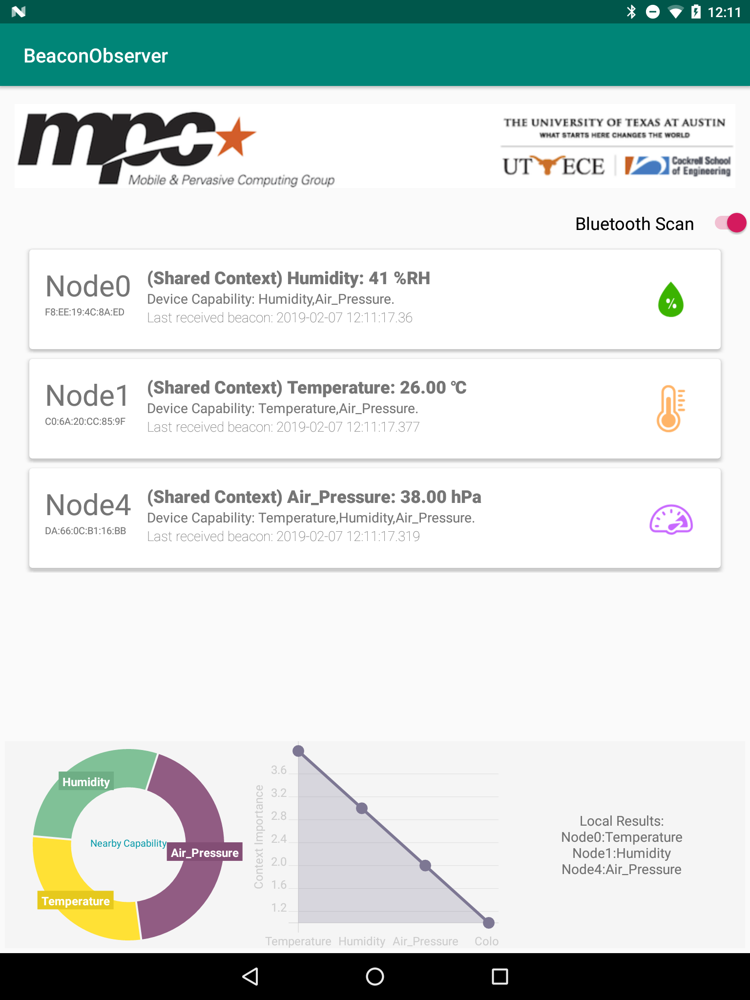
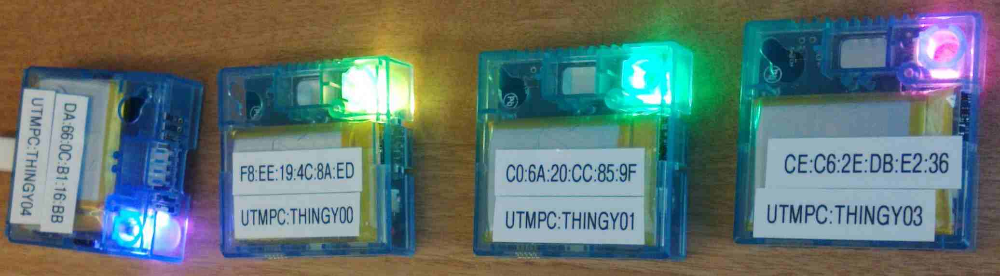

# Beacon Observer App (for Stacon demo)

## Getting Started

### Prepare the IoT sensor kits
Check [this repository](https://github.com/UT-MPC/BLEnd_Nordic/blob/master/README.md#percom-demo-stacon) for example projects on the Nordic Thingy52 platform and flash the ```percom_demo``` project.

### Install the Android app
- Minimum SDK requirement: _24_.
- Target SDK version: _27_.
- (We used Nexus 9 tablets during development)

## Misc.



